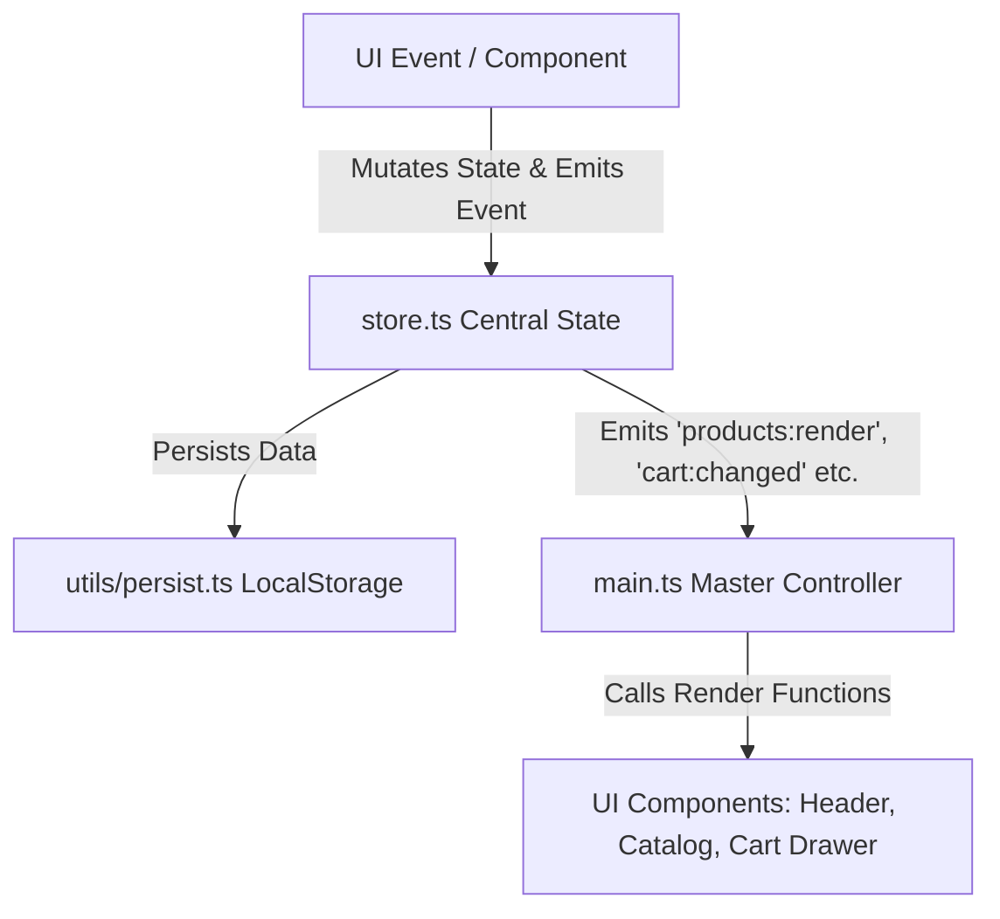

# 🛒 Amazon 2.0 – Moderner Premium Online-Shop


Ein extrem performantes, modernes und feature-reiches E-Commerce Web-Erlebnis inspiriert von Amazon, entwickelt mit **Vanilla TypeScript**, **Vite** und **Custom CSS Design System**.

---

## 📑 Inhaltsverzeichnis

- [Über das Projekt](#-über-das-projekt)
- [Hauptfunktionen (Features)](#-hauptfunktionen-features)
- [Technologiestack](#-technologiestack)
- [Ordnerstruktur & Dateiinhalte](#-ordnerstruktur--dateiinhalte)
- [Entwicklungsgeschichte & Changelog](#-entwicklungsgeschichte--changelog)
- [Installation & Schnellstart](#-installation--schnellstart)
- [Architektur & State Management](#-architektur--state-management)
- [Vorgeschlagene Zukünftige Verbesserungen & Roadmap](#-vorgeschlagene-zukünftige-verbesserungen--roadmap)
- [Lizenz & Impressum](#-lizenz--impressum)

---

## 💡 Über das Projekt

**Amazon 2.0** ist eine vollständige Re-Implementierung einer modernen Online-Shopping-Plattform. Ursprünglich als monolithisches JavaScript-Skript gestartet, wurde die Plattform im Laufe der Entwicklung komplett refaktoriert und auf eine modulare **TypeScript + Vite**-Architektur migriert.

Das Ziel des Projekts ist es, ein erstklassiges, flüssiges und responsives Einkaufserlebnis ohne externe schwere Frontend-Frameworks zu bieten. Es beinhaltet erweiterte E-Commerce-Features wie ein dynamisches Filter-System, Interaktive Preisverlauf-Diagramme, Live-Paketverfolgung, ein Command Palette Hub (`Ctrl+K`), KI-Empfehlungs-Logik, Seller Marketplace und PWA-Offline-Unterstützung.

---

## ✨ Hauptfunktionen (Features)

- 📊 **KI Spec Sheet Matrix**: Detailliertes Produktdatenblatt-Vergleichsraster mit Vor- & Nachteile-Analyse, Bewertungsscore & automatischer KI-Sieger-Empfehlung.
- ⚡ **Web3 & Krypto Checkout Gateway**: Bezahlung mit Bitcoin (BTC), Ethereum (ETH), Solana (SOL) & USDC mit Live-Kursumrechnung, QR-Code-Einzahlungsadresse & Blockchain-Bestätigung.
- 🎮 **Gamified Quests & Mystery Box Hub**: Tägliche Shopping-Quests, interaktiver Mystery-Box-Öffner mit Spin-Animation & sofortiger Guthaben-Freischaltung.
- 🛍️ **Virtueller 3D Shop-Room**: Begehbarer 3D-Showroom mit W/A/S/D-Tastatursteuerung, Perspektiven-Perspektiven-Raster, 3D-Regalreihen & Direktkauf-HUD.
- ⚡ **Live-Auktionen & Group Buying Engine**: Echtzeit-Auktionshaus mit Biet-Simulator (+5€ Schritte), Höchstbieter-Anzeige & Gruppen-Rabatt-System (-35% Rabatt bei 5 Käufern).
- 📹 **Live Commerce & Video-Stream Shopping**: HD Live-Shopping-Bühne mit Host-Stream, fliegenden Emoji-Reaktionen (❤️, 🔥, 👏, 😮), Live-Zuschauer-Chat & 1-Click Stream-Kauf.
- 🌐 **Multi-Language & Multi-Currency Engine**: Live-Umschaltung zwischen 4 Sprachen (Deutsch, English, Français, Español) und 4 Währungen (EUR, USD, GBP, CHF) mit automatischer Umrechnung.
- 📦 **3D & AR Studio (Canvas 3D Engine)**: Interaktive 360°-Produktrotation per Maus-Drag, Auto-Rotate, Farbwechsler & Augmented Reality (AR) Raum-Platzierungs-Simulator.
- 👥 **Social Shopping & Referral Hub**: Öffentlicher Wunschlisten-Link-Generator, Social-Media-Sharing (WhatsApp, Telegram, E-Mail) & "Freunde werben" 15€ Guthaben-Prämienprogramm.
- 💬 **Smart AI Live Support Chat Widget**: 24/7 interaktiver Kundenservice-Bot mit Echtzeit-Antworten zu Bestellungen, Paketverfolgung, Retouren, Gutscheinen & Guthaben.
- 🎨 **Cross-Browser & Safari-Fixes**: Vollständige `-webkit-backdrop-filter` Unterstützung und optimierte Webkit-Scrollbars für 100%ige IDE-Fehlerfreiheit.
- 🔍 **Erweiterte Suche & Filter-Engine**: Live-Textsuche, Kategorie-Auswahl, Preisspannen-Slider, Mindestbewertungen, Marken-Filter, Lagerbestand & Prime-Filter mit Filter-Chips.
- 🎙️ **Sprachsuche (Web Speech API)**: Echte Spracheingabe per Mikrofonsymbol mit animierter Höring-Welle und automatischem Filterergebnis.
- 📸 **KI-Bildsuche & Foto-Scanner**: Visuelle Produktsuche per Drag & Drop oder Beispiel-Fotos mit animierter Laser-Objekterkennung.
- 💳 **Stripe-Style Interaktiver Checkout**: 3D-Kreditkarten-Live-Vorschau (Nummernformatierung, CVV-Flip-Effekt, Marken-Erkennung Visa/Mastercard/Amex), PayPal Express, Apple Pay Biometrie-Simulation & 3D-Secure 2.0 Authentifizierungs-Modal.
- 🗺️ **Live-Karten Paketverfolgung (GPS Simulator)**: Animierte Routenkarte mit beweglichem Zustellfahrzeug, Echtzeit-Telemetrie (Fahrzeug-ID, Paketbote, Entfernung), Zeitstrahl & PDF-Rechnungsdrucker.
- 🧪 **Automatisierte Unit-Tests (Vitest)**: Integrierte Test-Suite (`npm run test`) zur automatischen Überprüfung von State, Filter-Engine und Utilities.
- ⚡ **Blitzangebote (Lightning Deals)**: Echtzeit-Countdown-Timer mit dynamischem Lagerbalken und automatischer Rabattberechnung.
- 📊 **Preisverlaufs-Chart**: Interaktives Canvas-2D-Diagramm im Produktmodal zur Visualisierung historischer Preisschwankungen.
- ⌨️ **Command Palette (`Ctrl+K` / `Cmd+K`)**: Tastatursteuerung für Power-User zum schnellen Navigieren, Suchen und Wechseln des Themes.
- 🚚 **Paketverfolgung & Live-Karte**: Realistische Liefer-Timeline mit Schritt-für-Schritt Status-Updates für alle Bestellungen.
- 🧾 **PDF-Rechnungsgenerator**: Generierung und Druckansicht von formatierten Kaufbelegen direkt aus dem Kundenkonto.
- 🤖 **KI-Empfehlungsmodul**: Personalisierte Produktvorschläge basierend auf bisher angesehenen Artikeln und Warenkorbinhalten.
- ⚖️ **Produktvergleich**: Side-by-Side Spezifikations- & Preisvergleichsdock für ausgewählte Produkte.
- 🎟️ **Gutschein-Center & Guthaben**: Einlösen von Aktionscodes, Guthabenverwaltung und automatische Rabattanrechnung im Checkout.
- 🏪 **Marketplace Seller-Portal**: Eigenes Einstellen von neuen Produkten für Drittanbieter/Verkäufer.
- 🔄 **Retouren-Manager**: Interaktiver Rückgabe-Assistent mit Grundauswahl und Vorschau des Retourenlabels.
- 🌙 **Dark/Light Theme**: Umschaltbares, persisted Design-System mit CSS-Variablen.
- 📱 **PWA & Offline-Fähig**: Service Worker Support (`sw.js`) und Manifest für App-Installation auf Mobil- und Desktopgeräten.

---

## 🛠️ Technologiestack

- **Language**: TypeScript 5.x / ESNext
- **Bundler / Dev Server**: Vite 8.x
- **Styles**: Custom Vanilla CSS (Design Tokens, Glassmorphism, CSS Grid & Flexbox)
- **Persistence**: LocalStorage mit typsicheren Fallbacks & Custom Event Bus (`emit` / `on`)
- **PWA**: Service Worker & Web App Manifest (`manifest.json`)
- **Icons & Typography**: Inline SVG Icons & Google Fonts (Inter)

---

## 📁 Ordnerstruktur & Dateiinhalte

```
Amazon 2.0/
├── .git/                      # Git-Revisionskontrolle
├── .gitignore                 # Ausgeschlossene Dateien (node_modules, dist etc.)
├── index.html                 # Haupteinstiegsseite & Semantisches HTML5 Markup
├── package.json               # Npm Package-Konfiguration & Scripts
├── tsconfig.json              # TypeScript Compiler-Konfiguration (Strict Mode)
├── app_original.js            # [Monolith-Archiv] Ursprünglicher JS-Code (v1.0)
├── public/                    # Statische Assets (Icons, Service Worker, Manifest)
│   ├── favicon.svg            # Shop Favicon Logo
│   ├── manifest.json          # PWA Web Application Manifest
│   └── sw.js                  # PWA Service Worker Caching & Offline Support
└── src/                       # Modularer Quellcode (TypeScript)
    ├── main.ts                # App Bootstrap, Event Listeners & Hauptsteuerung
    ├── store.ts               # Reaktiver State Store & Pub/Sub Event System
    ├── style.css              # Vollständiges CSS Design System & Theme-Variablen
    ├── data/                  # Statische Datenquellen
    │   ├── products.ts        # Produktkatalog mit Reviews, Q&A, Preishistorie
    │   └── heroSlides.ts      # Carousel Slides & Kategorien-Stammdaten
    ├── types/                 # Typsichere Schnittstellen (Interfaces)
    │   └── index.ts           # Product, CartItem, Order, UserProfile, Coupon etc.
    ├── utils/                 # Hilfsfunktionen & Persistence
    │   ├── formatters.ts      # Währungs- & Datumsformatierer, XSS Sanitizer, IDs
    │   └── persist.ts         # LocalStorage Read/Write Wrapper mit Error Handling
    └── components/            # UI-Komponenten (Modulbasiert)
        ├── header.ts          # Topbar, Suche, Badges, Avatar, Theme Toggle
        ├── catalog.ts         # Produktgrid, Filter-Sidebar, Filter Chips
        ├── cart.ts            # Warenkorb-Drawer (Slide-In), Mengenanpassung
        ├── checkout.ts        # Checkout Modal (Adresse, Zahlungsarten, Bestätigung)
        ├── productModal.ts    # Produktdetailansicht, Galerie, Price-Chart, Reviews
        ├── priceHistoryChart.ts # HTML5 Canvas Preisverlaufs-Chart Visualisierer
        ├── orders.ts          # Bestellhistorie, Paketverfolgung, PDF-Rechnung
        ├── wishlist.ts        # Wunschliste Modal & Schnellübernahme in Warenkorb
        ├── compare.ts         # Produktvergleich-Dock & Tabelle
        ├── coupons.ts         # Gutschein-Center Modal
        ├── giftCards.ts       # Geschenkkarte & Guthaben-Verwaltung
        ├── notifications.ts   # Benachrichtigungszentrum & Preis-Alerts
        ├── lightningDeals.ts  # Blitzangebote Echtzeit-Timer Component
        ├── commandPalette.ts  # Tastatur-Schnellnavigation (Ctrl+K)
        ├── profile.ts         # Nutzerprofil- & Adressverwalter
        ├── recommendations.ts # KI-Empfehlungskarussell
        ├── returns.ts         # Retourenprozess & Retourenschein
        ├── seller.ts          # Seller Marketplace Verkäuferportal
        ├── prime.ts           # Prime Mitgliedschafts-Vorteile Modal
        ├── recentlyViewed.ts  # Zuletzt angesehene Produkte Karussell
        └── toast.ts           # Systemweites Notification Toast System
```

---

## 📜 Entwicklungsgeschichte & Changelog

| Version / Commit | Datum | Beschreibung der vorgenommenen Änderungen |
| :--- | :--- | :--- |
| **v1.0.0** (Baseline) | Initial | Prototyping mit einer monolithischen JavaScript-Datei (`app_original.js`) für Katalog, Suche und Warenkorb. |
| **v1.1.0** (Refactoring) | Update | Vollständige Migration zu **TypeScript** und **Vite**. Zerlegung des Monolithen in ein klares `src/components/`-Pattern. |
| **v1.2.0** (Core Features) | Update | Einführung des reaktiven `store.ts` Pub/Sub-Event-Systems, LocalStorage-Persistence & Wunschliste. |
| **v1.3.0** (Interactive Tools) | Update | Implementierung von Produktvergleichs-Tool, Kundenbewertungen, Recently-Viewed-Karussell, Filter-Chips & Toast-System. |
| **v1.3.5** (Account & Services) | Update | Gutschein-Center, druckbare PDF-Rechnungsgenerierung, Profil- & Adressmanager, Q&A-System & Markenfilter. |
| **v1.4.0** (Advanced Ecosystem)| Update | Live-Karten-Paketverfolgung, Benachrichtigungscenter für Preisalarme, Geschenk-Guthaben-Hub, Blitzangebote-Engine (`Lightning Deals`) & `Ctrl+K` Command Palette. |
| **v1.4.1** (Quality & Cleanup) | Update | Typsicherheits-Optimierung (`npx tsc`), Bereinigung nicht genutzter Importe und Parameter, Absicherung des Vite Production Builds (`npm run build`). |
| **v1.5.0** (Smart Payments & Search) | Update | Stripe-Style Interaktiver Checkout (3D Card Preview, CVV Flip, Card Brand Auto-Detection, 3D-Secure 2.0 SMS Verification, Apple Pay Biometrie), Web Speech API Sprachsuche & KI-Bildsuche mit Foto-Laser-Scanner. |
| **v1.6.0** (Live Tracking & Vitest) | Update | Live-Karten Paketverfolgung mit beweglichem Zustellfahrzeug-Pin, Live-Telemetrie & PDF-Rechnungsgenerator, Integration der **Vitest** Unit-Test-Suite (`npm run test`) mit 13 automatisierten Tests. |
| **v1.7.0** (AI Support Chat & Safari Fix) | Update | 24/7 Smart AI Kundenservice Live-Chat Widget (`#supportChatWidget`), Behebung aller IDE CSS-Syntaxthemen für Safari-Kompatibilität (`-webkit-backdrop-filter`). |
| **v1.8.0** (3D Studio, i18n & Social) | Update | Multi-Language & Multi-Currency Engine (`i18n.ts`), Canvas 3D & AR Studio (`product3DViewer.ts`), Wunschlisten-Sharing & "Freunde werben" 15€ Bonus Hub (`shareWishlist.ts`). |
| **v1.9.0** (3D Store, Bidding & Live Commerce) | Update | Begehbarer 3D-Shoproom (`virtualStore.ts`), Live-Auktionen & Gruppen-Rabatt Engine (`liveAuctions.ts`), Live Commerce Stream Shopping Hub mit Emoji-Reaktionen & Chat (`liveCommerce.ts`). |
| **v2.0.0** (Spec Matrix, Web3 & Quests) | *Aktuell* | KI Spec Sheet Matrix (`specMatrix.ts`), Web3 Krypto Payment Gateway (`cryptoPayment.ts`), Shopping Quests & Mystery Box Rewards Engine (`rewardsQuest.ts`). |

---

## 🚀 Installation & Schnellstart

### Voraussetzungen
- **Node.js**: `v18.0.0` oder neuer
- **npm**: `v9.0.0` oder neuer

### 1. Repository klonen oder im Ordner öffnen
```bash
cd "Amazon 2.0"
```

### 2. Abhängigkeiten installieren
```bash
npm install
```

### 3. Entwicklungs-Server starten (Dev Mode)
```bash
npm run dev
```
Öffne die im Terminal angezeigte Adresse (standardmäßig `http://localhost:5173`) im Browser.

### 4. Produktion-Build erstellen & prüfen
```bash
# Type-Check und Vite Build
npm run build

# Vorschau des fertigen Production Builds
npm run preview
```

---

## 🏗️ Architektur & State Management

Das Projekt setzt auf ein leichtgewichtiges, typsicheres **Store-Pattern mit Pub/Sub-Events**:



- **Reaktivität**: Änderungen an `state.cart`, `state.wishlist`, `state.filters` etc. lösen gezielte Events (`emit('cart:changed')`) aus.
- **Entkopplung**: UI-Komponenten rufen rein funktionale Callbacks auf; der State ist die einzige "Single Source of Truth".

---

## 🔮 Vorgeschlagene Zukünftige Verbesserungen & Roadmap

Um **Amazon 2.0** noch professioneller und marktreifer für die Zukunft aufzustellen, werden folgende konkrete Verbesserungen empfohlen:

### 1. 🧪 Automated Testing Pipeline (Unit & E2E)
- **Empfehlung**: Integration von **Vitest** für Unit-Tests (z. B. für `formatters.ts`, State Reducer, Filter-Logik) und **Playwright** / **Cypress** für End-to-End Tests des Checkout-Flows.
- **Mehrwert**: Garantiert Regression-Freiheit bei neuen Feature-Releases.

### 2. 🌐 Backend-Integration & API Abstraktion (REST / GraphQL)
- **Empfehlung**: Ersetzung der statischen `products.ts` Daten durch eine REST API oder eine serverlose API (z. B. Node.js/Express, NestJS oder Supabase/Firebase backend).
- **Mehrwert**: Echte Benutzer-Authentifizierung (JWT/OAuth), serverseitige Lagerbestands-Aktualisierung in Echtzeit und persistente Datenbank-Speicherung.

### 3. 💳 Echte Zahlungs-Integration (Stripe SDK Sandbox)
- **Empfehlung**: Einbindung von **Stripe.js** im Testmodus (Stripe Elements) im Checkout.
- **Mehrwert**: Demonstriert eine echte 3D-Secure Kreditkartenabwicklung und Apple Pay / Google Pay Integration.

### 4. 🎨 TailwindCSS oder CSS Modules Refactoring
- **Empfehlung**: Trennung der monolithischen `style.css` (über 90KB) in atomare CSS-Module pro Komponente oder Migration zu **Tailwind CSS v4** mit Vite-Plugin.
- **Mehrwert**: Bessere Wartbarkeit der CSS-Stile und Vermeidung globaler CSS-Klassen-Kollisionen.

### 5. 🔍 KI-Sprach- & Bildsuche (Voice & Visual Search)
- **Empfehlung**: Einbindung der Web Speech API für echte Diktier-Suche sowie Upload-Funktion zur visuellen Ähnlichkeitssuche per Canvas/ML5.js.
- **Mehrwert**: Einzigartiges High-End Feature für moderne E-Commerce Plattformen.

### 6. ♿ Barrierefreiheit (Accessibility / WCAG 2.1 AA Compliant)
- **Empfehlung**: Vollständige Überprüfung aller Modale hinsichtlich Keyboard Focus Traps, `aria-live` Regionen für Toast-Meldungen und Kontrastverhältnis-Optimierung.
- **Mehrwert**: Barrierefreies Einkaufen für alle Nutzergruppen und professioneller Enterprise-Standard.

---

## 📄 Lizenz & Impressum

Erstellt als Open-Source Lernprojekt.  
© 2026 **Amazon 2.0 Project Team**. Alle Rechte vorbehalten.
