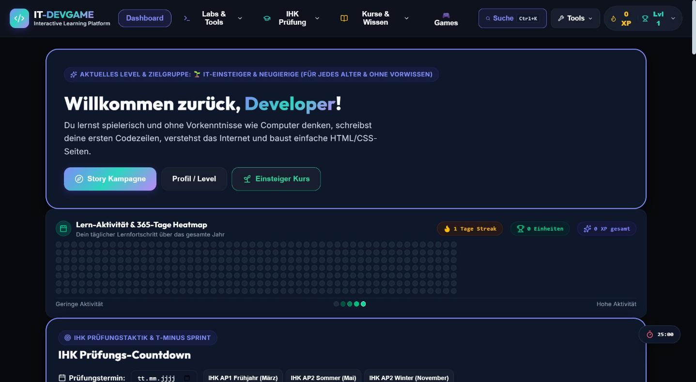
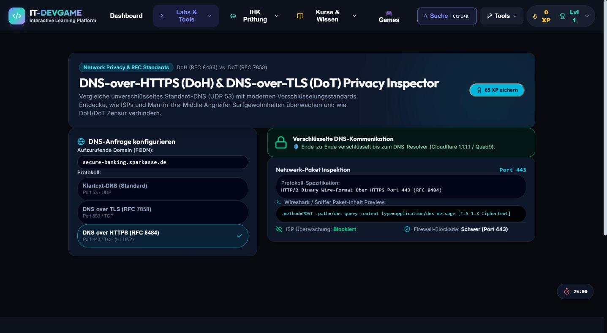

# 💻 IT-DevGame – Informatik-lernen

[](https://github.com/Schengii/Informatik-lernen/actions/workflows/ci.yml) [](LICENSE) [](https://informatik-lernen.vercel.app)  

Interaktive Lernplattform und Prüfungsvorbereitung für Fachinformatiker (FIAE, FISI, FIDP, FIDV, IT-SE) nach IHK-Standard – zugleich ein spielerischer Einstieg in die Informatik ohne Vorkenntnisse.

> 🌐 **Live (Vercel):** <https://informatik-lernen.vercel.app> · PWA, offlinefähig





## 📋 Inhalt
- [Überblick](#-überblick)
- [Ordnerstruktur](#-ordnerstruktur)
- [Funktionsweise](#-funktionsweise)
- [Barrierefreiheit](#-barrierefreiheit)
- [DSGVO & Datenschutz](#-dsgvo--datenschutz)
- [Installation & Befehle](#-installation--befehle)
- [Neues Lab anlegen](#-neues-lab-anlegen)
- [Dokumentation & Änderungshistorie](#-dokumentation--änderungshistorie)

## 🎯 Überblick

| Zielgruppe | Inhalte (Auszug) |
|---|---|
| 🌱 Einsteiger | Einsteiger-Kurs (EVA-Prinzip, CPU, Binärsystem, Internet & DNS), Vokabeln, Quizzes |
| ⚡ IT-Auszubildende | IHK-Lernfelder LF 1–12b, Prüfungssimulator für 5 Berufe, WISO-Kalkulationen, Netzwerk-/Backup-/Projekt-Studios, Noten- & MEP-Rechner, Fachgespräch-Simulator, Spickzettel-PDF |
| 🚀 Junior Developer | Coding-Challenges (Web-Worker-Sandbox), SQL-Sandbox, Git, REST/GraphQL, Docker, CI/CD |
| 🔥 Senior / Architekten | Kubernetes, eBPF, DNSSEC, TLS 1.3, WebAuthn, RAG/LLM, Observability, Linux-Kernel-Themen |

Die **vollständige, automatisch erzeugte Lab-Liste** steht in [`docs/LABS.md`](docs/LABS.md) (Quelle: `src/data/labModulesData.js`, Aktualisierung mit `npm run docs:labs`). Gamification: XP, Level, Badges, Streak, 365-Tage-Heatmap, Spaced Repetition (SM-2), Fehlerjournal.

## 📁 Ordnerstruktur

```
Informatik-lernen/
├── .agents/AGENTS.md          Regeln für KI-Agenten
├── .github/                   CI-Workflow, Dependabot, Issue-/PR-Templates
├── docs/                      LABS.md (generiert), README-Archiv.md (alte Feature-Historie bis v3.74.0)
├── e2e/                       Playwright-Tests (Smoke, A11y, PWA, Sandbox, Lab-Interaktionen)
├── public/                    Statische Assets, PWA-Icons
├── scripts/                   new-lab.js (Lab-Scaffold), gen-lab-list.js (docs/LABS.md), OG-Image
├── src/
│   ├── components/            Content/ (Labs), Games/, Navigation/, Shared/, Modals …
│   ├── data/                  labRegistry.js (Routing), labModulesData.js (Dashboard/Palette), Fragen-/Lerninhalte
│   ├── store/                 Zustand-Store (useStore.js) mit LocalStorage-/IndexedDB-Persistenz
│   ├── styles/global.css      CSS-Variablen-Design-System
│   └── utils/                 *Engine.js (reine Logik) + *.test.js, storage, sandboxRunner, uiPreferences
├── CHANGELOG.md               Änderungen (Keep a Changelog)
├── CLAUDE.md / GEMINI.md      Leitfäden für KI-Assistenten
├── _Projektuebersicht.md      Projektübersicht
└── vite.config.js, vercel.json, playwright.config.js, tsconfig.json, .oxlintrc.json
```

## ⚙️ Funktionsweise

1. **State (`zustand`)**: XP, Level, Badges, Fortschritt, SM-2-Karten, Aktivitätshistorie, Notizen liegen lokal im Browser (`localStorage`) und werden über `indexedDbStoreMiddleware.js` redundant in IndexedDB gesichert (Schutz vor Quota-Überschreitung / gelöschtem LocalStorage). Tab-übergreifender Sync per BroadcastChannel.
2. **Engine ↔ UI**: Berechnungen stehen als reine Funktionen in `src/utils/*Engine.js` (isoliert getestet), die UI in `src/components/Content/*.jsx` konsumiert sie und vergibt XP.
3. **Lab-Routing**: Jedes Lab ist ein Eintrag in `src/data/labRegistry.js` und wird per `React.lazy` nachgeladen; `labModulesData.js` liefert Metadaten für Dashboard und Command-Palette (bewusst getrennt, damit Icons/Beschreibungen nicht im Haupt-Bundle landen).
4. **Code-Sandbox**: Nutzercode läuft in einem Web Worker (3 s Timeout, kein DOM-/Storage-/Netzwerkzugriff) – kein Rückfall auf den Haupt-Thread.
5. **PWA & Bundle**: `vite-plugin-pwa` mit Precache der App-Chunks; Vendor-Chunks (`react/ui/charts/pdf/sql`) mit `size-limit`-Budgets, schwere Chunks per Runtime-Cache.
6. **Audio**: Soundeffekte werden zur Laufzeit per Web Audio API synthetisiert.
7. **Qualität (CI)**: `lint:ci` → `typecheck` → `test` → `test:coverage` → `build` → `size` → `e2e`. Smoke- und axe-A11y-Tests rendern jedes Lab automatisch.

## ♿ Barrierefreiheit

Dyslexie-Modus, Farbenblindheits-Modus, Reduced Motion (`prefers-reduced-motion` und `body.reduced-motion`), Schriftgrößen-Skalierung, Text-to-Speech, kein Zoom-Blocker (WCAG 2.1). Einstellungen bleiben unter `informatik_game_ui_prefs_v1` erhalten; ohne eigene Auswahl gelten die Systemvorgaben.

## 🔒 DSGVO & Datenschutz

- Alle Lernfortschritte verbleiben lokal auf dem Gerät.
- Vercel Web Analytics ohne Cookies und ohne IP-Speicherung; optionales Sentry-Monitoring nur mit `VITE_SENTRY_DSN` (siehe `.env.example`).

## 🚀 Installation & Befehle

Voraussetzung: Node ≥ 22.19.

```bash
npm install
npm run dev            # Entwicklungsserver (http://localhost:5173)
npm test               # Unit-Tests (Vitest)
npm run test:fast      # schneller Testlauf ohne A11y-/Routing-Tests
npm run test:coverage  # Coverage-Report
npm run lint           # Oxlint (CI: lint:ci)
npm run typecheck      # tsc für Dateien mit // @ts-check
npm run build          # Produktions-Build
npm run size           # Bundle-Budgets (nach build)
npm run e2e            # Playwright gegen den Build
npm run new-lab        # Lab-Scaffold (siehe unten)
npm run docs:labs      # docs/LABS.md neu erzeugen
```

## 🧩 Neues Lab anlegen

```bash
npm run new-lab -- RaidLevel "RAID-Level Studio" hardware Intermediate
```

Das Skript erzeugt Engine, Engine-Test und Lab-Komponente und trägt das Lab am Anfang von `labRegistry.js` und `labModulesData.js` ein. Danach: Engine/UI ausarbeiten, Beschreibung/Tags/Icon anpassen, `npm run docs:labs`, `CHANGELOG.md` und `_Projektuebersicht.md` ergänzen. Details: [CLAUDE.md](CLAUDE.md).

## 📝 Dokumentation & Änderungshistorie

- Änderungen je Version: [`CHANGELOG.md`](CHANGELOG.md)
- Lab-Übersicht: [`docs/LABS.md`](docs/LABS.md)
- Ausführliche Feature-Beschreibungen und Änderungshistorie bis v3.74.0: [`docs/README-Archiv.md`](docs/README-Archiv.md)

### Aktuelle Version (v3.75.0)

- **Dokumentation**: README von rund 2100 auf wenige Dutzend Zeilen verschlankt; frühere Fassung unverändert unter `docs/README-Archiv.md`.
- **Tooling**: `npm run new-lab` (Lab-Scaffold) und `npm run docs:labs` (automatisch erzeugte Lab-Liste).

---

## 📄 Lizenz

Dieses Projekt steht unter der [MIT-Lizenz](LICENSE).
