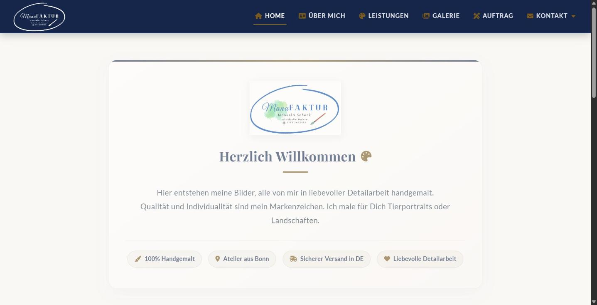

# 🎨 ManuFAKTUR Schenk – Kunst & Auftragsmalerei Webanwendung

[](https://github.com/Schengii/ManuFaktur/actions/workflows/ci.yml) [](https://www.manufaktur-malerei.de)  

Eine moderne, elegante und barrierefreie Webanwendung für das Kunst-Atelier **ManuFAKTUR Schenk** (Manuela Schenk aus Bonn). Die Webseite präsentiert handgemalte Kunstwerke (Tierportraits, Landschaften, Stillleben) und bietet Besuchern einen interaktiven 4-Schritte-Auftragskonfigurator, eine hochoptimierte Bildergalerie mit KI-Raumhintergründen, multiperspektivischer "Weitere Ansichten"-Galerie, Live-Suche sowie ein Kundenstimmen-Karussell.

> **In short (EN):** Production website for an art studio in Bonn, built with plain HTML5, CSS3 and vanilla JavaScript (no framework, no tracker). Features a 4-step order configurator, a filterable gallery of 56 artworks with AI room previews, DE/EN i18n, dark/light mode, PWA with service worker, WCAG-minded accessibility, and a strict CSP with auto-generated hashes. Fonts and icons are self-hosted for GDPR compliance.
>
> 🌐 **Live:** [manufaktur-malerei.de](https://www.manufaktur-malerei.de/)



---

## 📁 Ordnerstruktur

```text
ManuFaktur/
├── index.html                  # Hero-Einstiegsseite (eigenes Mini-Skript, lädt Home.js nicht)
├── Home.html                   # Startseite (Willkommen, Highlights, Kundenstimmen-Karussell)
├── Bildergalerie.html          # Filterbare Galerie (56 Werke, KI-Wandvorlagen, Lightbox)
├── Leistungen.html             # Leistungsübersicht & FAQ
├── Auftrag.html                # Interaktiver 4-Schritte-Auftragskonfigurator
├── UeberMich.html              # Porträt & Steckbrief der Künstlerin, Werdegang, 3D-Visitenkarte
├── Kontakt.html                # Kontaktformular (Web3Forms) & Direktkontakt
├── Impressum.html              # Anbieterkennzeichnung mit 2-Klick-Google-Maps
├── Datenschutz.html            # DSGVO-Datenschutzerklärung
├── 404.html                    # Fehlerseite
│
├── style.css / style.min.css   # Designsystem (Quelle) / minifizierter Build
├── Home.js / Home.min.js       # Zentrale Logik (Quelle) / minifizierter Build
├── sw.js                       # Service Worker (Offline-Cache)
├── partials/lightbox.html      # Gemeinsame Lightbox – wird per Build in Home.html & Bildergalerie.html kopiert
├── scripts/                    # Build-, Prüf- und Hilfsskripte (siehe „Build für Produktion“)
├── tests/                      # Browser-Tests (node:test + playwright-core)
├── robots.txt / sitemap.xml    # SEO (Sitemap wird von npm run sitemap erzeugt)
│
└── assets/
    ├── js/                     # theme-init.js, index-page.js, auftrag.js, artworks-data.js (Werkdaten)
    ├── documents/              # Flyer (PDF), Visitenkarte (PDF, VCF)
    ├── fonts/                  # Lokale Schriften (Lato, Playfair Display, Dancing Script)
    ├── vendor/font-awesome/    # Font Awesome lokal; ausgeliefert wird nur das Subset icons.min.css
    └── images/
        ├── logos/              # Logos & Favicons
        ├── og/                 # Link-Vorschaubilder 1200 × 630 (npm run images:og)
        ├── flyer/, print-media/ # Flyer- und Visitenkarten-Ansichten
        ├── rooms/              # KI-Raumkulissen für die Wandvorschau
        ├── img/, artworks/     # Werke: lightbox/ID.webp (1600 px) und thumbs/ID-{400,700,1000}w.webp
        └── manuela-balou.webp  # Künstlerin & Hund Balou
```

---

## 📄 Detaillierter Inhalt der Dateien & Features

### 1. `Home.html` / `index.html`
- **Funktion:** Startseite der Webanwendung.
- **Inhalt:**
  - Willkommensbereich mit Atelier-Logo und Einleitungstext.
  - Highlights-Raster mit ausgewählten Gemälden.
  - **Kundenstimmen-Karussell:** Interaktiver Testimonial-Slider mit Sternebewertungen und Zitaten zufriedener Auftraggeber.
  - Schema.org JSON-LD Strukturierte Daten (`ArtGallery`).

### 2. `Bildergalerie.html` & Lightbox-System
- **Funktion:** Interaktive High-End Kunstgalerie für alle 56 Gemälde mit KI-Wandvorlagen, Drag & Drop Positionierung, Skalierung & Multiperspektiven.
- **Inhalt & Features:**
  - **Authentischer Werkkatalog (56 Gemälde):** Vollständige Erfassung aller 56 Originalgemälde mit echten Werkstiteln (*Godesburg modern, Drachenfels, Balou, Siebengebirge, Dünenweg Normandie, Texel Leuchtturm, Traumpfad Kottenforst, Ast mit Zitronen, Boote an der französischen Atlantikküste, Weg auf Island, etc.*), exakten Maßen (*z.B. 40×50 cm, 100×150 cm, 19×19 cm*), Maltechniken (*Öl, Acryl, Multimediatechnik, Ölkreide auf handgerahmtem Birkenholz*) und persönlichen Künstler-Beschreibungen.
  - **Perfekt ausgerichtete Bildausrichtung (Upright Auto-Orientation):** Sämtliche 56 WebP-Thumbnails und Lightbox-Großansichten wurden anhand ihrer Aufnahmeparameter und Bildachsen automatisch korrigiert und aufgerichtet, sodass jedes Kunstwerk direkt richtig herum nach oben weist.
  - **Kompakte Galerie-Filterleiste:** Aufgeräumtes Suchfeld sowie nebeneinander platzierte Kategorie-Filter (*Alle, Tiere, Landschaften, Pflanzen, Sonstiges, Gemerkt/Favoriten*) und direkt rechts folgendem **Sortieren-Dropdown** (*A-Z, Z-A*).
  - **Detaillierte Werk-IDs & Favoriten-Herz-Buttons (`.fav-toggle-btn`):** Jedes der 56 Kunstwerke besitzt eine explizite HTML `id="DSC_..."` sowie dynamisch initialisierte Herz-Buttons zur Favoriten-Speicherung.
  - **LCP-Ladeoptimierung:** Die ersten 4 Kunstwerke oberhalb des Fold-Bereichs werden mit `loading="eager"` und `fetchpriority="high"` geladen für herausragende Google PageSpeed & Lighthouse LCP-Werte.
  - **Barrierefreie Tastatur- & Input-Schutzsteuerung:** Pfeiltasten-Navigation überspringt aktive Formularfelder, damit Benutzereingaben ungestört bleiben.
  - **Benutzerfreundliche Leerzustände (Empty-State):** Angepasste Hilfetexte bei 0 Treffern oder noch leeren Favoriten.
  - **Perfektionierte HD-Lupenfunktion (`🔍 Lupe Zoom`):** Mathematisch präzise Maus- & Touch-Lupenlinse mit relativer Container-Offset-Berechnung für flüssigen Zoom ohne Ruckeln.
  - **Reine Erstansicht im Lightbox-Modal:** Beim Anklicken eines Galeriebildes öffnet sich die Lightbox in der klaren **Pur-/Frontansicht** mit Bild, Titel, Beschreibung und Produktspezifikationen.
  - **Aktivierbare KI-Wandvorlagen:** Erst nach Klick auf den Button `In deinem Raum ansehen` werden die KI-Wandfilter-Leiste (*Wohnzimmer, Schlafzimmer, Loft, Beige Lounge*) und die Wandbühne eingeblendet.
  - **Interaktive Drag & Drop Positionierung:** Im KI-Raummodus kann der Nutzer das Gemälde frei auf der Raumwand nach oben, unten, links oder rechts verschieben (`🎯 Zentrieren` setzt die Position zurück).
  - **Interaktive Wand-Skalierung (`25% - 90%` Slider):** Stufenloses Skalieren der Bildgröße für das perfekte Maßverhältnis zum Raumhintergrund.
  - **„Weitere Ansichten:“ (Multiperspektivische Galerie):** 5 interaktive Blickwinkel (*Frontansicht, Wandansicht, Keilrahmen-Rückseite, 3D-Seitenansicht, Atelier*).
  - **Clean Galerie-Karten:** Übersichtliche Galerie-Karten mit ungestörtem Herz-Favoriten-Button oben rechts (`.fav-toggle-btn`).
  - Schema.org JSON-LD Strukturierte Daten (`ImageGallery`, je Werk `VisualArtwork` – generiert per `npm run jsonld`).

### 3. `Auftrag.html`
- **Funktion:** Interaktiver 4-Schritte-Auftragskonfigurator.
- **Schritte:**
  1. **Motiv:** Auswahl zwischen Tierportrait, Landschaft, Stillleben oder Wunschmotiv.
  2. **Format:** Auswahl der Leinwandgröße (20×30 cm bis 60×80 cm oder Wunschmaß) mit visueller Größenanzeige.
  3. **Technik:** Auswahl der Maltechnik (Acryl, Öl, Bleistift, Aquarell).
  4. **Zusammenfassung:** Detaillierte Auftragsübersicht & direkte Formularübermittlung.
- **Features:** State-Wiederherstellung bei versehentlichem Schließen (localStorage) & automatisches Vorausfüllen bei Weiterleitung aus der Galerie via URL-Parametern (`?ref=...&kat=...`).

### 4. `Leistungen.html`
- **Funktion:** Übersicht über das Leistungsangebot der Künstlerin.
- **Inhalt:**
  - Dienstleistungskarten für Hundeportraits, Haustiere, Lieblingsorte & Formate.
  - FAQ-Akkordeon für häufige Fragen zu Fotovorlagen, Lieferzeiten und Versand.
  - Schema.org JSON-LD Strukturierte Daten (`Service`, `FAQPage`).

### 5. `UeberMich.html`
- **Funktion:** persönliche Vorstellung & künstlerischer Werdegang von Manuela Schenk.
- **Inhalt:**
  - Steckbrief (Wohnort Bonn-Bad Godesberg, Frauchen von Hund Balou, Techniken, Alanus Hochschule Alfter, Motivation).
  - **Künstlerische Ausbildung & Dozierende:** Dokumentation der akademischen Stationen an der *Alanus Hochschule Alfter* (Dozierende Angelika Kehlenbach, Cornelia Genschow, Johanna Hendel, Lukas Thein), dem *Art Studio Maryam Khalili* sowie *Kunstschule Aachen & VHS Bonn*.
  - Zeitstrahl („Mein Weg zur Kunst“ von 2010 bis heute).
  - Interaktive 3D-Flip-Visitenkarte mit VCF-Kontaktkarten-Download.
  - Schema.org JSON-LD Strukturierte Daten (`Person`).

### 6. `Kontakt.html`
- **Funktion:** Kontaktseite mit Anfragen-Formular & Direktkontakt.
- **Inhalt:** Formular mit Web3Forms-Integration, Kontaktdaten, Social-Media-Links (Instagram, WhatsApp, LinkedIn) und Vorab-Hinweis-Banner bei Weiterleitungen aus dem Konfigurator.

### 7. `Impressum.html` & `Datenschutz.html`
- **Funktion:** Rechtssichere Pflichtangaben nach deutschem Recht und DSGVO inklusive DSGVO-konformer 2-Klick Google Maps Karte im Impressum (`#map-container`).

### 8. `style.css`
- **Funktion:** Zentrales Designsystem.
- **Inhalt:** CSS-Variablen (`:root` Farbtokens: warmes Gold `#7a5a1f`, Marineblau `#1a2d52`, Linnen `#faf8f5`), vollständiges **Light- und Dark-Mode-Farbschema** (`data-theme="dark"` / `.dark-mode`), CSS Grid/Flexbox Layouts, 3D-Perspektivtransformationen (`rotateY`), Micro-Animations, Glassmorphism-Effekte, WCAG-Barrierefreiheit & responsive Breakpoints (Desktop, Tablet, Smartphone).

### 9. `Home.js`
- **Funktion:** Zentrale JavaScript-Architektur.
- **Inhalt:**
  - Automatische Injektion von shared `<header>` Navigation und `<footer>`.
  - **Zweisprachige Lokalisierung (DE/EN):** Deutsch steht im HTML, Englisch kommt aus `I18N_DICTIONARY` über `data-i18n*`-Attribute; beim Zurückschalten werden die deutschen HTML-Originale wiederhergestellt.
  - **Dark/Light Mode Theme Toggle:** Umschaltung zwischen hellem und dunklem Design mit automatischer Systempräferenz-Erkennung und LocalStorage-Speicherung.
  - **Urheberrechtsschutz & Wasserzeichen:** Copyright-Wasserzeichen-Badge in der Lightbox-Großansicht und Rechtsklick-Schutz mit Hinweis-Toast.
  - Hamburger-Mobilmenü-Steuerung.
  - Galerie-Filterung nach Kategorie, Live-Suche & Sortierung.
  - Dynamisches Favoriten-Management (`initFavButtonsUI`, `toggleFavorite`, Badge-Counter & LocalStorage).
  - DSGVO 2-Klick Google Maps Ladefunktion (`loadGoogleMap` für Impressum).
  - Lightbox-Slideshow, Tastatursteuerung & Touch-Swipe-Gesten.
  - Multiperspektivische KI-Wandbühnen-Steuerung (`setLightboxScene` & `setLightboxViewAngle`).
  - Kundenstimmen-Karussell mit Pause-Schalter (pausiert auch bei Hover/Fokus und bei „Bewegung reduzieren“).
  - LocalStorage State-Persistence & URL-Parameter-Parsing (`runOnDOMReady`).

---

## 🛠️ Technologien & Standards

- **Core:** HTML5, Vanilla CSS3, JavaScript (ES6+).
- **Mehrsprachigkeit & Theming:** Nahtloser Sprachwechsel (Deutsch / Englisch) und Light/Dark Mode ohne externe Frameworks oder Reloads.
- **DSGVO-Konformität:** 100 % lokale Einbindung aller Fonts (`Dancing Script`, `Playfair Display`, `Lato`) und Font Awesome Webfonts (keine externen Aufrufe an Google Fonts oder CDN-Server).
- **Barrierefreiheit (WCAG 2.1 AA / AAA):**
  - **Rot-Grün-Schwäche (Colorblindness):** Alle aktiven Zustände (Filter-Buttons, Navigation, Favoriten) nutzen neben Farbaccenten zusätzliche Form- und Textindikatoren (Symbole, fette Schrift, Border, Unterstreichung).
  - **Lese-Rechtschreib-Schwäche (Dyslexia-Friendliness):** Optimierter Zeilenabstand (`1.65`), Wortabstand (`0.04em`) und Zeichenabstand (`0.02em`) mit klarer serifenloser Typografie (`Lato`).
  - **Tastatur- & Screenreader-Support:** Sichtbare Fokus-Ringe (`:focus-visible`), ARIA-Attribute (`role="dialog"`, `aria-label`, `aria-expanded`), automatische Schutzsteuerung bei Texteingaben, „Zum Hauptinhalt springen“-Skip-Link (`.skip-link`) auf jeder Seite.
- **Responsive Design & Touch-Targets:** Flüssige Typografie (`clamp()`), kein horizontales Scrollen auf Smartphones, Touch-Targets mit mindestens 44px Höhe.
- **Micro-Animations:** Button-Shimmer-Effekt (`.btn::before`), Card Hover Elevation (`translateY(-6px)`), sanfte Scroll-Reveals und Puls-Effekte.
- **Performance & SEO:** WebP-Bildformate (99% Ersparnis), LCP-Optimierung, minifizierte CSS/JS-Produktions-Builds, Font-Preloading, Schema.org JSON-LD strukturierte Daten (inkl. `BreadcrumbList`), kanonische URLs (`rel="canonical"`), Open Graph Meta-Tags, PWA Web App Manifest & Service Worker, individuelle 404-Fehlerseite.
- **Formular-Spamschutz:** Verstecktes Botcheck-Honeypot-Feld (`botcheck`) im Kontaktformular gegen automatisierte Bot-Einsendungen.

---

## 🚀 Veröffentlichungs-Checkliste (Release Readiness)

1. **Release bauen:** `npm run release` zählt die Asset-Version (`?v=N` in allen Seiten und `sw.js`, `CACHE_NAME`) hoch, erzeugt die Sitemap neu und führt `npm run build` aus. Ergebnis inklusive der generierten Dateien committen.
2. **Prüfen:** `npm test` (Browser-Tests) und `npm run check:gallery` (Werkdaten ↔ HTML ↔ Bilddateien). Die CI prüft zusätzlich, ob alle generierten Dateien zum Quellstand passen.
3. **Web3Forms-Key (`Kontakt.html`):** Access-Key ist hinterlegt; Spam-Schutz per Honeypot-Feld (`botcheck`) ist aktiv.
4. **Deploy-Ausschlüsse:** `archive_sources/` und `assets/imgTxt/` (Rohdaten, ca. 560 MB) sind per `.gitignore` ausgeschlossen und dürfen auch beim manuellen Hochladen nicht mitkopiert werden.
5. **Rechtstexte prüfen:** Kleinunternehmer-Formulierung (§ 19 UStG) im Impressum und die Hoster-Angabe (Vercel) in der Datenschutzerklärung müssen zum tatsächlichen Stand passen.

---

## 💻 Lokale Entwicklung

```bash
npm install   # einmalig: Build- und Test-Werkzeuge
npm start     # http://localhost:3000 – mit derselben Content-Security-Policy wie live
```

`npm start` sendet die Header aus `vercel.json` mit, sodass CSP-Verstöße schon lokal in der Konsole auffallen (`python -m http.server` oder `npx serve` tun das nicht).

Alle Seiten binden die generierten Dateien (`style.min.css`, `Home.min.js`, Icon-Subset, Lightbox-Partial …) ein. Nach Änderungen an den Quellen deshalb `npm run build` ausführen.

---

## 📦 Build für Produktion

Bearbeitet werden nur die Quellen; alles andere erzeugt `npm run build` und wird mit eingecheckt (beim Deploy gibt es keinen Build-Schritt):

| Befehl | Aufgabe |
| :--- | :--- |
| `npm run build` | alles unten in dieser Reihenfolge |
| `npm run partials` | kopiert `partials/lightbox.html` in Home.html und Bildergalerie.html |
| `npm run jsonld` | erzeugt die VisualArtwork-Strukturdaten in Bildergalerie.html aus `assets/js/artworks-data.js` |
| `npm run icons` | baut das Font-Awesome-Subset (`icons.min.css` + `*-subset.woff2`) aus den tatsächlich benutzten Icons |
| `npm run build:css` / `build:js` | minifiziert `style.css` / `Home.js` |
| `npm run csp:update` | berechnet die CSP-Hashes der JSON-LD-Blöcke und schreibt sie in `vercel.json` **und** `.htaccess` |

Weitere Skripte: `npm run release` (Version hochzählen + Sitemap + Build), `npm run version:check`, `npm run check:gallery`, `npm run sitemap`, `npm run images:srcset` (Thumbnails), `npm run images:og` (Link-Vorschaubilder).

**Wichtig:** Die `.min`-Dateien, das Icon-Subset und die Bereiche zwischen `<!-- partial:… -->`/`<!-- generated:… -->` nie von Hand bearbeiten – sie werden beim nächsten Build überschrieben.
